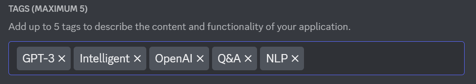

# <b> Discord GPT </b>
This is a Discord bot that will use the OpenAI API, to be
able to query and recieve very useful information like you 
would in ChatGPT, except within merely your Discord chats.  

You can invite it to your server using the following link: 
https://discord.com/api/oauth2/authorize?client_id=1050671337049423932&permissions=517544057920&scope=bot

## <b> What is ChatGPT? </b>
ChatGPT is a chatbot web application written by the developers
at OpenAI to be used in conjunction with their own API that uses
GPT-3's neural network of deep learning.

## <b> What makes this project different? </b>
I decided that not only was I going to code a Discord bot that uses the OpenAI API, but I was also going to code the Discord bot, using the OpenAI API...... 
### What on Earth does that mean?  
It means that in order to code this bot, I will rely on external Internet sources as little as possible, and try to use ChatGPT to help me with almost any question I have in order to complete this project! (as much as possible at least)  
### Why am I doing this?  
What is the point of creating a project around a deep-learning API if that OpenAI's neural networks can't truly answer important questions and help developers write code (as it is promoted). So this isn't just a challenge for myself, but rather for OpenAI as well; to see how reliable it really is in performing these kinds of tasks. 
There are exceptions. This being the offical documentation provided by Discord and OpenAI, and external resources IF official documentation nor ChatGPT can provide the answers. But unless it comes to that, no YouTube tutorials, StackOverflow, GeeksForGeeks, W3 Schools, freeCodeCamp, etc.

## <b>Process</b>
First, I began with posing the general query to ChatGPT.  
  
So, I followed its directions. I went onto the Discord [Applications] (https://discord.com/developers/applications page) of the Developer Portal, and created a new Discord bot (it's important to note that I do have a bit of experience creating and coding Discord bots in the past, though not a lot).   
Next, I had the option to put 5 tags for the bot, so I consulted ChatGPT once again!  
 
I ultimately went with these 5 tags:  
  
The following decision though was honestly the hardest, and was something I was trying to think really hard about:  Which programming language do I use to code this bot? Python or JavaScript? 
Both are exceptional programming languages, especially when it comes to applications such as this. 
I decided to use NodeJS to build this bot, as discord.js is more up to date (where discord.py) and hosting NodeJS applications is more streamlined than hosting Python applications. In addition, I don't usually code as much in JavaScript as I do in Python, so I figured "Why not?"   

So then how was it? Well...honestly not as smooth as I thought it would be.   
Any experienced developer who has played around with ChatGPT knows that while the AI is very impressive at delivering large bodies of code and detailed descriptions based on queries for projects and debugging, it most certainly has its limitations. 
The main issue, at least when it comes to a project like this, is that GPT-3's model was trained prior to 2022, so if you try to answer questions with knowledge from this year will be very difficult for it. This is especially an issue when many coding libraries like discord.js and OPENAI's are constantly changing.  

  In summary, while ChatGPT was able to help me with some code so long as I was specific and took it one step at a time, both it and official documentation were not as helpful as it should have been (in my humble opinion at least).